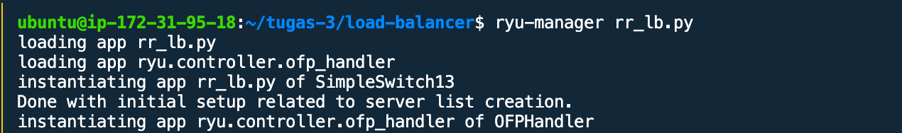
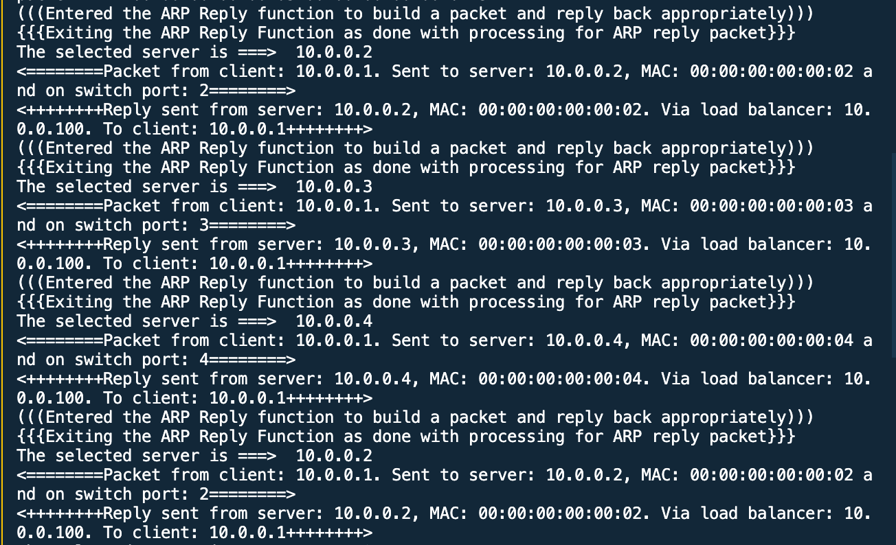
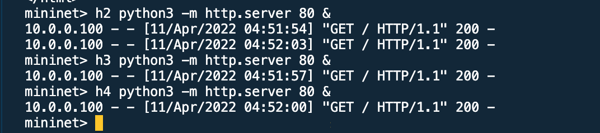

# RYU-Load-Balancer-Round-Robin-Method

This program is a program to create load balancing on a 1 Switch topology with 4 hosts using the RYU Controller.
h1 as a client, while h2 to h4 as a web server. The virtual ip used is 10.0.0.100. 
h1 will access the virtual ip many times and the load balancer process will run.

Run the load balancer program

```
ryu-manager rr_lb.py
```

Run topology program
```
sudo python3 topo_lb.py
```
On mininet, run h1 to access 10.0.0.100 many times. For example 4 times.

in the load balancer program, when h1 accesses the server, there will be a distribution of requests to the server in turn according to the round robin method.


when checked h2 there are 2 requests, h3 1 request, h4 1 request.


